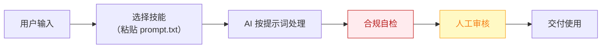

# SEO 架构师 — 业务架构

## 四层视图

```mermaid
flowchart TD
    subgraph L1["① 用户层"]
        U["依赖 Google SEO 获客的出海工具站/SaaS 开发者（约占群体 1/3）"]
    end

    subgraph L2["② 数字员工层"]
        E["SEO 架构师<br/>出海独立站"调研→写作→发布→监控"的 SEO 全链路闭环助理"]
    end

    subgraph L3["③ 工作流层（6 条）"]
        W1["关键词调研"]
        WN["…共 6 条"]
    end

    subgraph L4["④ 原子技能层（7 个）"]
        SK1["关键词聚类"]
        SK2["SERP 竞争分析"]
        SK3["内容大纲生成"]
        SK4["程序化页面生成"]
        SK5["多语言写作"]
        SK6["内链智能配对"]
        SK7["排名波动预警"]
    end

    U -->|"提出需求"| E
    E -->|"编排调用"| W1
    W1 --> WN
    W1 --> SK1

    style L1 fill:#E8F4FD,stroke:#1976D2,color:#0D47A1
    style L2 fill:#FFF3E0,stroke:#E65100,color:#BF360C
    style L3 fill:#F3E5F5,stroke:#7B1FA2,color:#4A148C
    style L4 fill:#E8F5E9,stroke:#388E3C,color:#1B5E20
```

## 资产形态说明

本资产包为**纯提示词客户端资产**：

| 特性 | 说明 |
|------|------|
| 无运行时依赖 | 不调用任何模型 API，不需要 API Key |
| 平台无关 | 提示词为纯文本，可导入任意主流 AI 平台 |
| 用户自备算力 | 模型由用户自己的订阅提供 |
| 零服务端成本 | 资产方不产生任何调用费用 |

## 数据流



> **关键设计**：所有对外输出必须经过「合规自检 → 人工审核」双闸门。

## 能力边界

| 维度 | 内容 |
|------|------|
| **目标用户** | 依赖 Google SEO 获客的出海工具站/SaaS 开发者（约占群体 1/3） |
| **做** | 关键词调研、内容差距分析、大纲与文章产出、内链建议、排名监控 |
| **不做** | 不做：黑帽 SEO（采集站群/伪原创堆砌）、保证排名承诺 |
| **KPI** | 月均产出 SEO 文章 ≥8 篇；目标词 90 天内进入 Top20 比例；自然搜索流量环比 |
| **定价** | ¥149-299/月——**客单价潜力最强**，对标 SurferSEO $89/月以 1/3 价格做全链路；ROI 汇总：月省约 30h ≈ ¥2400 + 流量增量，回报比约 8-16 倍 |

---

*本图由 build_p0_assets.py 自动生成*
