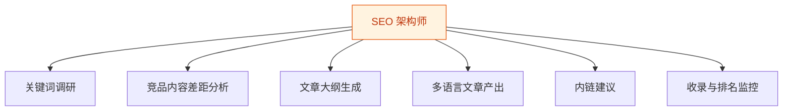
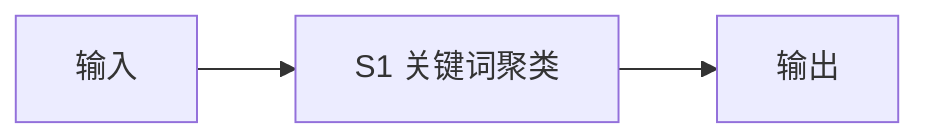
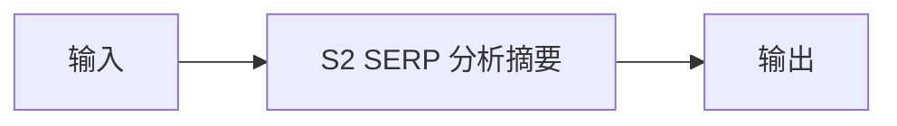
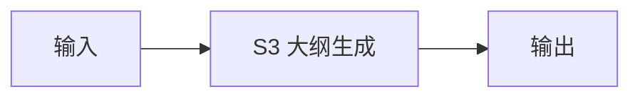
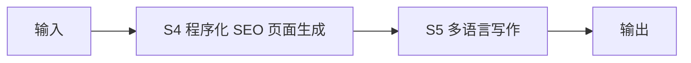
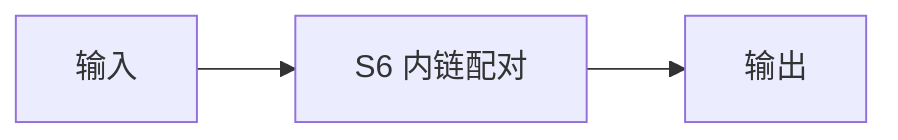
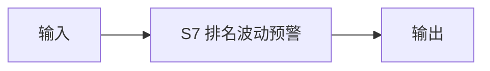

# SEO 架构师 — 工作流流程图

本员工共 **6 条工作流**，下辖 **7 个原子技能**。

## 总览

## 分条详情

### 关键词调研

| 项目 | 内容 |
|------|------|
| 触发 | 人工（每月） |
| 复杂度 | `M` |
| 阶段 | `P1` |
| ROI | 省 6h/月 ≈ ¥480 |

### 竞品内容差距分析

| 项目 | 内容 |
|------|------|
| 触发 | 事件（调研后） |
| 复杂度 | `M` |
| 阶段 | `P1` |
| ROI | 省 4h/月 ≈ ¥320 |

### 文章大纲生成

| 项目 | 内容 |
|------|------|
| 触发 | 人工 |
| 复杂度 | `S` |
| 阶段 | `P1` |
| ROI | 省 1h/篇 |

### 多语言文章产出

| 项目 | 内容 |
|------|------|
| 触发 | 事件（大纲确认后） |
| 复杂度 | `M` |
| 阶段 | `P1` |
| ROI | 省 3h/篇，月 8 篇 ≈ ¥1900 |

### 内链建议

| 项目 | 内容 |
|------|------|
| 触发 | 定时（每周） |
| 复杂度 | `M` |
| 阶段 | `P2` |
| ROI | 省 2h/月 ≈ ¥160 |

### 收录与排名监控

| 项目 | 内容 |
|------|------|
| 触发 | 定时（每周） |
| 复杂度 | `M` |
| 阶段 | `P2` |
| ROI | 止损型 ROI |

## 汇总表

| # | 工作流 | 阶段 | 复杂度 | 触发 | 涉及技能数 |
|---|--------|------|--------|------|-----------|
| 1 | 关键词调研 | `P1` | `M` | 人工（每月） | 1 |
| 2 | 竞品内容差距分析 | `P1` | `M` | 事件（调研后） | 1 |
| 3 | 文章大纲生成 | `P1` | `S` | 人工 | 1 |
| 4 | 多语言文章产出 | `P1` | `M` | 事件（大纲确认后） | 2 |
| 5 | 内链建议 | `P2` | `M` | 定时（每周） | 1 |
| 6 | 收录与排名监控 | `P2` | `M` | 定时（每周） | 1 |

---

*本图由 build_p0_assets.py 自动生成*
